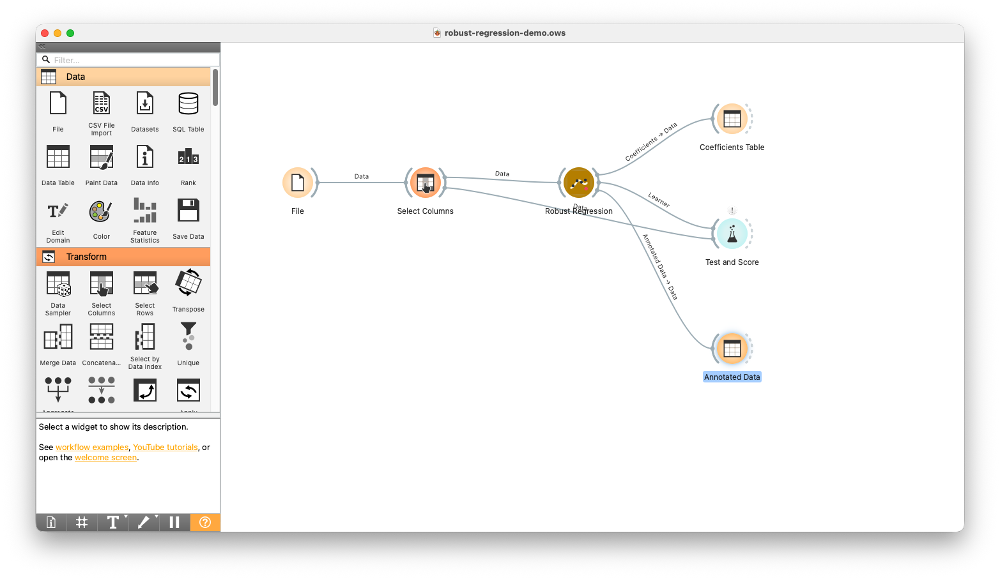
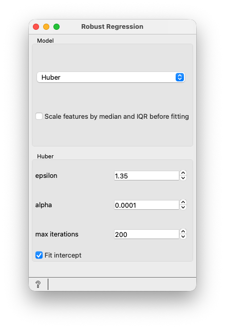

# Robust Regression for Orange

This Orange add-on adds two widgets for learning how regression behaves when a
data set contains outliers.

Ordinary linear regression fits the line or plane that minimizes squared error.
That makes large errors very influential: a few unusual rows can pull the model
away from the main pattern. Robust regression methods reduce that effect in
different ways.

## Widgets

### Robust Regression

Fits a robust linear regression learner. The widget currently includes:

- **Huber**: behaves like ordinary least squares for small residuals, but gives
  less influence to large residuals.
- **Least Absolute Deviation**: fits by absolute error when the quantile is
  `0.5`, so it targets the conditional median rather than the conditional mean.
  You can change the quantile to fit lower or upper conditional quantiles.
- **RANSAC**: repeatedly fits candidate models from small subsets, then keeps
  the model supported by the largest group of inliers.
- **Theil-Sen**: estimates slopes from many small subsets and combines them in a
  way that is resistant to outliers.

The widget outputs a learner for **Test and Score** and **Predictions**. If you
connect a data set with a continuous target variable, it also outputs a fitted
model, a coefficient table, and an annotated data table.

### Robust Scale

Centers continuous features by the median and scales them by a quantile range,
usually the interquartile range. This is useful when large values should not
determine the scale of a feature.

## Suggested Workflow

1. Add **File** or **Datasets**.
2. Add **Select Columns** and choose a continuous target variable.
3. Add **Robust Regression**.
4. Connect **Robust Regression** to **Test and Score** or **Predictions**.
5. Connect the **Annotated Data** output to **Data Table** to inspect residuals.
6. Connect the **Coefficients** output to **Data Table** to inspect fitted terms.

The demo workflow in `docs/examples/robust-regression-demo.ows` shows this
layout:

One set of widget settings looks like this:

## What To Inspect

The **Annotated Data** output adds:

- the model prediction for each row;
- the residual, computed as actual value minus prediction;
- a RANSAC inlier flag when RANSAC is selected.

The **Coefficients** output lists the intercept and fitted coefficients when the
selected method exposes them. These are useful for comparing robust fits with
ordinary linear regression on the same data.

## Notes

Do not use **Robust Scale** before **Robust Regression** if the regression
widget's internal scaling checkbox is also enabled, because that scales
continuous features twice.

Developer setup and release notes are in `DEVELOPMENT.md`.
