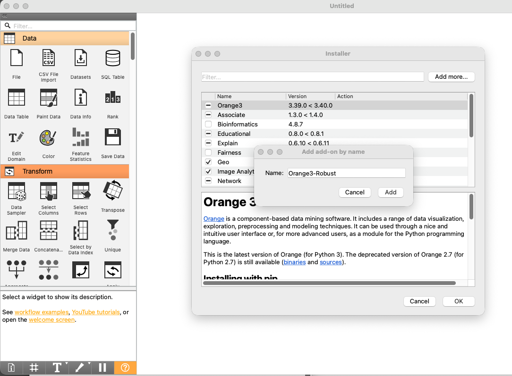
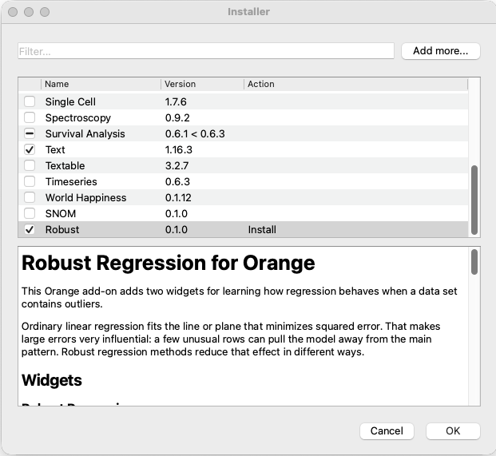

# Installing Orange3-Robust in Orange

Open **Options** > **Add-ons...**, choose **Add more...**, and enter the package
name:

```text
Orange3-Robust
```



Orange will add **Robust** to the install list. Leave it checked, press **OK**,
and restart Orange when installation finishes.


